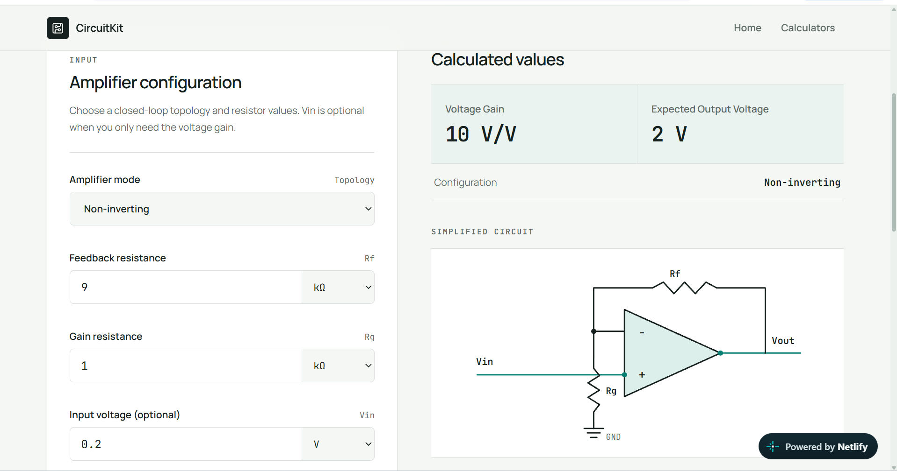

# CircuitKit

一个面向电子工程学习者、Maker 和初学者的实用在线电子工程计算工具箱。

CircuitKit is a practical, unit-aware electronics calculator toolkit with visible formulas and calculation steps.

## 在线体验 / Live Demo

[https://circuitkit.netlify.app/](https://circuitkit.netlify.app/)

## 项目简介

CircuitKit 用于解决电子工程学习和基础电路设计中的常见计算问题。用户可以直接使用熟悉的工程单位输入参数，查看计算结果、公式、代入过程和简短的工程说明，无需手动将所有数值换算为 SI 单位。

项目采用纯数学逻辑与 React UI 分离的结构，便于测试、维护，并为未来扩展 API 或移动端应用保留空间。

## 项目截图

### 首页


### Op-Amp Gain Calculator



## 五个计算器

CircuitKit MVP 的五个计算器均已完成并可在线使用。

| Calculator | 功能 |
| --- | --- |
| Voltage Divider（分压计算器） | 计算输出电压和分压器电流 |
| LED Resistor（LED 限流电阻计算器） | 计算理论阻值、E12/E24 推荐阻值、实际电流偏差和电阻功耗 |
| RC Filter（RC 滤波器计算器） | 计算一阶 Low-pass / High-pass 滤波器的截止频率与时间常数 |
| Op-Amp Gain（运算放大器增益计算器） | 计算 Inverting / Non-inverting 放大器的理想闭环增益 |
| RLC Resonance（RLC 谐振计算器） | 计算理想 LC 网络的谐振频率和角谐振频率 |

## 核心特点

- 工程单位自动换算
- 内部统一使用 SI 单位计算
- 动态公式与计算过程
- 合理的工程单位与前缀格式化
- 输入验证和易于理解的错误提示
- 简短实用的 Engineering Notes（工程说明）
- 响应式桌面端、平板和移动端布局
- 数学逻辑与 React UI 分离
- 核心单位转换与计算逻辑具备自动化测试

## 技术栈 / Tech Stack

- **Next.js**：App Router、页面路由、Metadata 和生产构建
- **React**：交互式计算器界面与状态管理
- **TypeScript**：类型安全的输入、单位和计算结果
- **Tailwind CSS**：响应式布局与项目视觉样式
- **Vitest**：单位转换、输入验证和数学逻辑测试
- **Netlify**：生产构建与公网部署
- **Git / GitHub**：版本控制与公开项目托管

## 项目结构

```text
src/
  app/                    # 页面路由、Metadata、错误页面和全局样式
  components/             # 共享 UI 与 React 组件
    calculators/          # 五个计算器界面和简化电路图
    ui/                   # 项目维护的基础 UI 组件
  lib/
    calculators/          # 与 React 无关的纯数学计算和输入验证
    electronics/          # E12 / E24 标准电阻系列等电子工程工具
    units/                 # 单位定义、SI 换算和工程格式化
```

`DESIGN.md` 记录项目的视觉设计规范，`UX-CONTRACT.md` 记录交互和可访问性约定。

## 本地开发 / Local Development

需要 Node.js 20.9 或更高版本。仓库中的 `.nvmrc` 使用 Node.js 24。

```bash
npm install
npm run dev
```

- `npm install`：安装项目依赖
- `npm run dev`：启动本地开发服务器

启动后访问 [http://localhost:3000](http://localhost:3000)。

## 测试与质量检查 / Testing

```bash
npm run test
npm run lint
npm run typecheck
npm run build
```

- `npm run test`：运行 Vitest 自动化测试
- `npm run lint`：检查代码规范和常见问题
- `npm run typecheck`：执行 TypeScript 类型检查
- `npm run build`：验证 Next.js 生产构建

测试覆盖工程单位换算、结果格式化、E12/E24 标准阻值推荐、非法输入处理，以及五个计算器的核心数学逻辑。

## Roadmap

- 补充正式项目截图
- 为计算公式和工程假设补充参考来源
- 继续完善测试和可访问性验证
- 在英文 MVP 稳定后评估界面本地化
- 探索复用现有纯计算模块的 API 或移动端应用

## License

本项目使用 [MIT License](LICENSE)。

Copyright (c) 2026 xiaoyle
